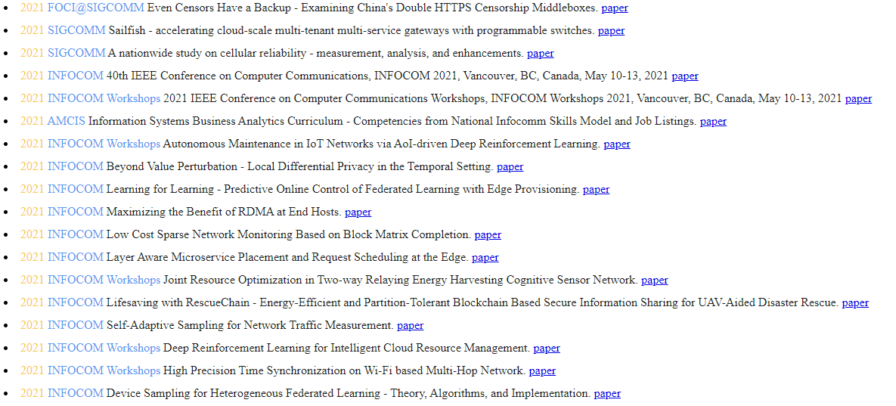

# PaperHub

## Overview

PaperHub is a command line tool to search papers using [dblp](https://dblp.org/) api.

## Features

- Search by publisher.
- Sort paper by time.
- Custom color scheme.

## Installation

python=3.7+

```
pip install -r requirements.txt
```

## Settings

There are few settings for you in `settings.json` 

- `publishers`: a pre-defined list of publishers to specify when you choose ‘search by publishers’.

- `number_per_search`: number of papers to show for each search.

- `number_per_publisher`: max number of papers for each publisher.

- `style`: how to show searching result. Can be `default` or `rainbow`(colorful entries).

- `line_height`: line height in `px`.

- `rainbow_color`: color of components of entries in hex. 

  > You may find some pretty color scheme [here](http://brandcolors.net/).

## Usage

```
python dblpSearch.py
```

Then input keywords to search & choose whether to use pre-defined list of publisher.

## Demo

